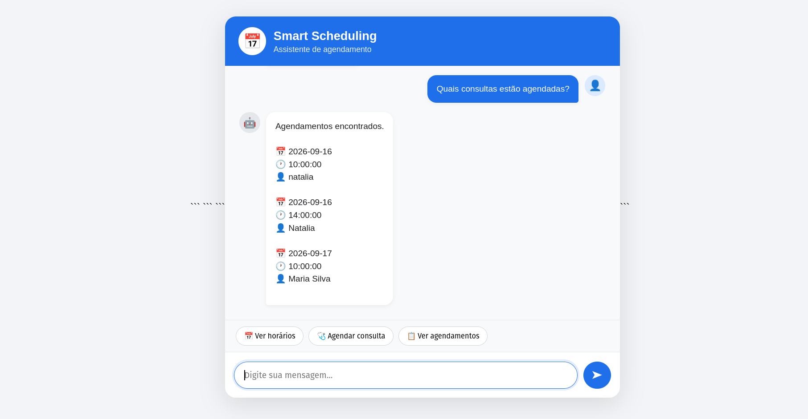

# Smart Scheduling

Sistema web de agendamento de consultas desenvolvido como desafio técnico Full Stack.

A aplicação simula o fluxo de atendimento de uma clínica que recebe solicitações de agendamento e precisa consultar horários disponíveis, validar dias úteis e feriados e registrar as consultas em um banco de dados.

## Sobre o projeto

O **Smart Scheduling** permite:

* Consultar horários disponíveis para uma determinada data;
* Bloquear automaticamente finais de semana;
* Bloquear feriados nacionais do Brasil;
* Criar agendamentos;
* Impedir conflitos de horário;
* Consultar os agendamentos cadastrados;
* Utilizar uma API pública real para consulta de feriados;
* Utilizar inteligência artificial para interpretar mensagens relacionadas a agendamentos.

O sistema foi desenvolvido com arquitetura Full Stack, utilizando Django REST Framework no backend, PostgreSQL para persistência dos dados e HTML, CSS e JavaScript no frontend.

## Funcionalidades

### Consulta de disponibilidade

O usuário informa uma data e o backend:

1. Verifica se a data é um final de semana;
2. Consulta a API pública de feriados;
3. Verifica os horários já ocupados no banco de dados;
4. Retorna os horários disponíveis.

### Criação de agendamento

O usuário informa:

* Nome;
* Telefone;
* Data;
* Horário.

O backend valida:

* Se a data é um dia útil;
* Se a data não é feriado;
* Se o horário está dentro do funcionamento da clínica;
* Se o horário ainda está disponível.

Após as validações, o agendamento é persistido no PostgreSQL.

### Assistente com IA

O projeto também possui um endpoint de assistente que utiliza a API do Gemini para interpretar mensagens em linguagem natural.

Exemplos:

> "Tem horário amanhã?"

> "Quero marcar uma consulta terça às 14h."

> "Quais consultas estão agendadas?"

A IA transforma a mensagem em uma intenção estruturada, permitindo que o backend identifique ações como:

* `check_availability`
* `book_appointment`
* `list_appointments`
* `unknown`

A IA é utilizada para interpretação da mensagem. As regras de negócio, validações e persistência continuam sendo responsabilidade do backend.

## Arquitetura

```text
┌──────────────────────┐
│      Frontend        │
│   HTML/CSS/JavaScript│
└──────────┬───────────┘
           │ HTTP/REST
           ▼
┌──────────────────────┐
│   Django + DRF       │
│      Backend         │
└──────┬───────┬───────┘
       │       │
       │       ├──────────────► Nager.Date API
       │       │                 Feriados
       │       │
       │       └──────────────► Gemini API
       │                         Interpretação IA
       ▼
┌──────────────────────┐
│     PostgreSQL       │
│      Database        │
└──────────────────────┘
```

## Fluxo principal

```text
Usuário
   ↓
Escolhe uma data
   ↓
Frontend solicita disponibilidade
   ↓
Backend consulta a API de feriados
   ↓
Backend verifica final de semana
   ↓
Backend verifica horários ocupados
   ↓
Horários disponíveis são retornados
   ↓
Usuário escolhe um horário
   ↓
Backend valida o agendamento
   ↓
Agendamento é salvo no PostgreSQL
   ↓
Confirmação é retornada
```

## Tecnologias

### Backend

* Python
* Django
* Django REST Framework
* Requests
* PostgreSQL
* Poetry

### Frontend

* HTML5
* CSS3
* JavaScript

### Integrações

* Nager.Date API
* Google Gemini API

### Infraestrutura e desenvolvimento

* Git
* GitHub
* Docker

## API

### Consultar horários disponíveis

```http
GET /api/available?date=2026-09-15
```

Exemplo de resposta:

```json
{
  "date": "2026-09-15",
  "available": true,
  "holiday": null,
  "slots": [
    "08:00",
    "09:00",
    "10:00",
    "11:00",
    "12:00",
    "13:00",
    "14:00",
    "15:00",
    "16:00",
    "17:00"
  ]
}
```

### Criar agendamento

```http
POST /api/appointments
```

Body:

```json
{
  "patient_name": "Maria Silva",
  "patient_phone": "83999999999",
  "date": "2026-09-15",
  "time": "14:00"
}
```

### Listar agendamentos

```http
GET /api/appointments
```

### Assistente com IA

```http
POST /api/assistant
```

Body:

```json
{
  "message": "Quero marcar uma consulta amanhã às 14h"
}
```

O backend utiliza o Gemini para interpretar a intenção e extrair, quando disponíveis, a data e o horário solicitados.

## Regras de negócio

* Horário de funcionamento: **08:00 às 18:00**;
* Cada consulta possui duração de **1 hora**;
* Não são permitidos agendamentos aos finais de semana;
* Não são permitidos agendamentos em feriados;
* Não é permitido ocupar um horário já reservado;
* A validação de disponibilidade é realizada no backend;
* A persistência dos agendamentos é realizada no PostgreSQL.

## API de feriados

O backend consome a API pública Nager.Date:

```text
https://date.nager.at/api/v3/PublicHolidays/2026/BR
```

A consulta é realizada pelo backend para verificar se a data selecionada corresponde a um feriado no Brasil.

## Estrutura do projeto

```text
smart-scheduling/
│
├── appointments/
│   ├── migrations/
│   ├── ai_service.py
│   ├── holiday_service.py
│   ├── models.py
│   ├── serializers.py
│   ├── services.py
│   ├── urls.py
│   └── views.py
│
├── config/
│   ├── settings.py
│   ├── urls.py
│   └── ...
│
├── frontend/
│   ├── index.html
│   ├── script.js
│   └── style.css
│
├── .env
├── .gitignore
├── Dockerfile
├── docker-compose.yml
├── manage.py
├── poetry.lock
├── pyproject.toml
└── README.md
```

## Como executar o projeto

### 1. Clonar o repositório

```bash
git clone URL_DO_REPOSITORIO
cd smart-scheduling
```

### 2. Instalar as dependências

O projeto utiliza Poetry:

```bash
poetry install
```

### 3. Configurar as variáveis de ambiente

Crie um arquivo `.env` na raiz do projeto:

```env
DB_NAME=smart_scheduling
DB_USER=postgres
DB_PASSWORD=SUA_SENHA
DB_HOST=localhost
DB_PORT=5432

GEMINI_API_KEY=SUA_CHAVE
```

A chave da API do Gemini não deve ser versionada no GitHub.

### 4. Executar as migrações

```bash
poetry run python manage.py migrate
```

### 5. Iniciar o backend

```bash
poetry run python manage.py runserver 8001
```

O backend ficará disponível em:

```text
http://127.0.0.1:8001
```

### 6. Iniciar o frontend

Em outro terminal:

```bash
cd frontend
python3 -m http.server 5500
```

Acesse:

```text
http://127.0.0.1:5500
```

## Testando a API

As rotas podem ser testadas utilizando ferramentas como Postman.

Exemplo:

```http
GET http://127.0.0.1:8001/api/available?date=2026-09-15
```

Para criar um agendamento:

```http
POST http://127.0.0.1:8001/api/appointments
```

Com:

```json
{
  "patient_name": "Maria Silva",
  "patient_phone": "83999999999",
  "date": "2026-09-15",
  "time": "14:00"
}
```

## Objetivo técnico

O projeto foi desenvolvido com foco em:

* Desenvolvimento de APIs REST;
* Integração com APIs externas;
* Persistência de dados relacionais;
* Implementação de regras de negócio no backend;
* Integração de inteligência artificial;
* Desenvolvimento Full Stack;
* Organização de um projeto Python utilizando Poetry;
* Boas práticas de versionamento com Git.

## Autora

**Natália Santos**

